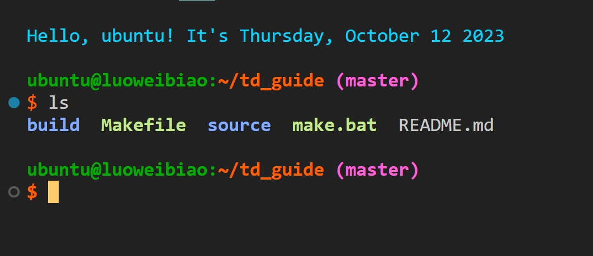
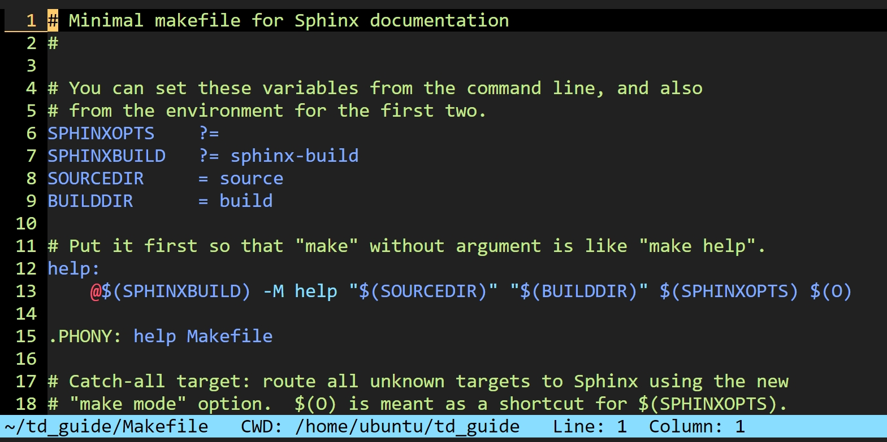

# DotFiles Windows

- Windows 下用户配置文件。

## Bash 配置

- 配置文件：
  - `.bashrc`，`.bash_profile` - bash 配置文件，启用`.shells`文件夹下所有配置文件。
  - `.shells/alias` - 常用命令缩写，git，tar，grep，ls等。
  - `.shells/defaults` - bash 相关默认配置。
  - `.shells/exports` - 环境变量。
  - `.shells/functions` - shell 函数。
  - `.shells/prompt` - bash 提示样式。
- 配置预览：
- 

## Python Pip 配置

- 配置文件：`.pip`文件夹。

## Conda Pip 配置

- 配置文件：`pip`文件夹。

## Vim 配置

- 配置文件：
  - `.vim`文件夹。
  - `.vimrc`文件。
- 配置预览：
- 

## ReadLine 配置

- 与`Bash`自动补全相关的程序，某些终端按下`Tab`屏幕会闪烁，就与该程序相关。
- 配置文件：`.inputrc`。

## Git 配置

- 配置文件：`.gitconfig`。

## Pycharm vim 配置

- 配置文件：`.ideavimrc`。

## 安装使用

- 替换文件`.gitconfig`中的名字以及邮箱。
- 打开 `Git Bash`:
  - `cp -rf .shells .vim .vimrc .bashrc .bash_profile .inputrc .gitconfig .pip pip ~`
